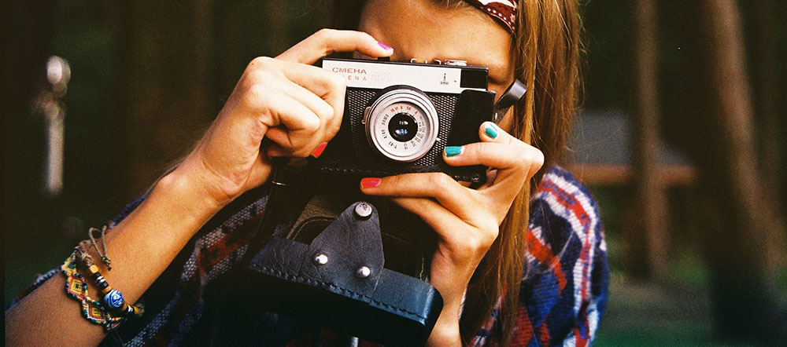

# Copyright and Images

### Free to use images

There are a large number of free to use images. You can search Google for images that are copyright free, Flickr also has an option to search for images under the Creative Commons License. You need to be aware that even though images are free to use there may be some restrictions, such as an attribution and/or link back to the creator, or there will be restrictions of use, such as non-commercial or they cannot be edited or combine with other images. 

[Find out more about Creative Commons images >>](https://martinsolent.github.io/copyright/copyright2016_v2/)

